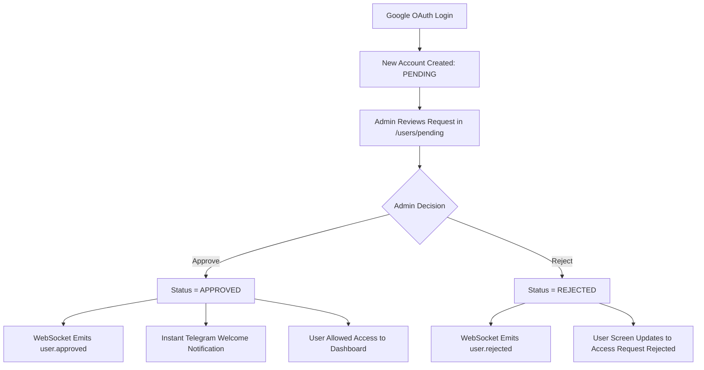

# IncidentHub Admin

> A production-quality, secure, invite-only incident management and Telegram notification platform built with NestJS, React, and MongoDB.

[](https://nestjs.com)
[](https://react.dev)
[](https://typescriptlang.org)
[](https://mongodb.com)
[](https://redis.io)
[](https://core.telegram.org/bots)

---

## 🌐 Live Deployment Links

- **Frontend App (Vercel):** [https://incident-bot-delta.vercel.app](https://incident-bot-delta.vercel.app)
- **Backend API (Render):** [https://incident-bot-ocdt.onrender.com](https://incident-bot-ocdt.onrender.com)

---

## 📋 Project Overview

IncidentHub Admin is an enterprise-grade incident management and telemetry alert platform where:
- Users authenticate via **Google OAuth 2.0**
- Authentication token is issued via **HttpOnly Cookie** with a **Bearer Token Fallback** for cross-domain browser cookie shielding
- First-time users are placed in **PENDING** status until approved by an **Admin**
- Approved users can link their **Telegram** account with 1-click token authorization
- Admins create, manage, and close system **incidents**
- **Telegram Bot** sends instant alert notifications to approved users with Chat ID deduplication
- **BullMQ** handles background notification queues with exponential backoff retries
- A **Scheduled Cron Job** scans active incidents every 5 minutes and alerts approved users
- All administrative actions are recorded in **Audit Logs**
- **WebSockets** push real-time updates across the dashboard and user waiting screens

---

## ✨ Key Features

- 🔐 **Google OAuth 2.0 Authentication** with Hybrid Cookie & Bearer Authorization Token handling
- 🛡️ **JWT + Role-Based Access Control (RBAC)** (Strict server-side guards for `ADMIN` vs `USER`)
- 👤 **User Approval Workflow** (`PENDING` → `APPROVED` / `REJECTED`)
- 🤖 **Telegram Bot Integration** with automatic Polling mode & Webhook support
- 🚨 **Incident Management** with severity levels (`LOW` / `MEDIUM` / `HIGH` / `CRITICAL`)
- 🎯 **Chat ID Deduplication** to prevent duplicate Telegram notifications per incident
- 📡 **BullMQ Queue Engine** for reliable async message processing & retries
- ⏰ **5-Minute Notification Scheduler** (`@nestjs/schedule` cron)
- 📊 **Audit Logging** for administrative action history
- ⚡ **Real-time WebSockets** (Socket.IO) for live status & approval updates
- 🐳 **Docker Compose** setup for API, MongoDB, and Redis
- 💻 **Stitch-Inspired Dark UI** (Tailwind CSS v4) with responsive mobile drawer navigation (`100dvh` viewport support)

---

## 🛠️ Technology Stack

### Backend (`/api`)
| Technology | Purpose |
|---|---|
| NestJS + TypeScript | Enterprise REST API framework |
| MongoDB + Mongoose | NoSQL Database & ORM |
| Passport + JWT | Authentication & Session Guards |
| Cookie-Parser | Secure HttpOnly Cookie handling |
| Google OAuth 2.0 | SSO Identity provider |
| BullMQ + Redis | Async job queue & failure retry |
| @nestjs/schedule | Cron background jobs |
| Socket.IO | WebSockets for live events |
| node-telegram-bot-api | Telegram Bot integration |
| class-validator & class-transformer | Strict DTO Validation |

### Frontend (`/admin`)
| Technology | Purpose |
|---|---|
| React 19 + TypeScript | UI Framework |
| Vite | Build & HMR bundler |
| Tailwind CSS v4 | Styling engine |
| React Router v7 | Client-side routing & protected routes |
| TanStack React Query v5 | Server state management |
| Axios | HTTP Client with credential cookies & Bearer interceptor |
| Socket.IO Client | Real-time event listener |
| Lucide React | Modern icons |
| Sonner | Toast notifications |

---

## 🏗️ Architecture

```
┌─────────────────────────────────────────────────────┐
│             Admin Frontend (/admin)                 │
│        (Vite + React + TanStack Query)               │
└──────────────────────┬──────────────────────────────┘
                       │ HTTP (Cookies/Bearer) + WebSocket
┌──────────────────────▼──────────────────────────────┐
│             NestJS Backend API (/api)                │
│  ┌──────────┐ ┌───────────┐ ┌─────────────────────┐ │
│  │   Auth   │ │   Users   │ │     Incidents        │ │
│  │  Module  │ │  Module   │ │      Module          │ │
│  └──────────┘ └───────────┘ └─────────────────────┘ │
│  ┌──────────┐ ┌───────────┐ ┌─────────────────────┐ │
│  │ Telegram │ │  Notifs   │ │    Audit Logs        │ │
│  │  Module  │ │  Module   │ │      Module          │ │
│  └──────────┘ └───────────┘ └─────────────────────┘ │
│  ┌──────────┐ ┌────────────────────────────────────┐ │
│  │WebSocket │ │      BullMQ Workers                │ │
│  │ Gateway  │ │  + Scheduled Jobs (5min)           │ │
│  └──────────┘ └────────────────────────────────────┘ │
└───────┬──────────────────────────┬────────────────────┘
        │                          │
┌───────▼──────┐          ┌────────▼──────┐
│   MongoDB    │          │     Redis     │
│   (Atlas)    │          │  (BullMQ)     │
└──────────────┘          └───────────────┘
                                   │
                          ┌────────▼──────┐
                          │  Telegram Bot │
                          │      API      │
                          └───────────────┘
```

---

## 📁 Repository Structure

```
IncidentHub-Admin/
├── api/                        # NestJS Backend API Service
│   ├── src/
│   │   ├── auth/               # Google OAuth + JWT Strategy + Cookie/Bearer Handler
│   │   │   ├── guards/         # JwtAuthGuard + GoogleAuthGuard
│   │   │   └── strategies/     # Passport strategies
│   │   ├── users/              # User management (Pending/Approved/Rejected)
│   │   ├── incidents/          # Incident CRUD & status management
│   │   ├── notifications/      # BullMQ queue processor + 5-min scheduler + Deduplication
│   │   ├── telegram/           # Bot service (Polling & Webhook)
│   │   ├── audit-logs/         # System audit action logging
│   │   ├── websocket/          # Socket.IO Gateway
│   │   ├── common/             # RolesGuard, @Roles(), @CurrentUser()
│   │   └── database/
│   │       └── schemas/        # User, Incident, Notification, AuditLog schemas
│   ├── .env.example
│   ├── Dockerfile
│   └── package.json
├── admin/                      # React Frontend Dashboard Application
│   ├── src/
│   │   ├── api/                # Axios instance + API endpoints
│   │   ├── components/         # Sidebar, TopBar, ConfirmModal, Skeleton
│   │   ├── context/            # AuthContext (Cookie/Bearer auth state)
│   │   ├── hooks/              # useSocket custom hook
│   │   ├── pages/              # LoginPage, DashboardPage, UsersPage, IncidentsPage, etc.
│   │   └── types/              # TypeScript Interfaces
│   ├── .env.example
│   ├── vercel.json             # SPA Rewrites rule
│   └── package.json
├── docker-compose.yml
├── vercel.json
└── README.md
```

---

## 🗄️ Database Schemas

### 1. User Schema
```typescript
{
  name: String,
  email: String,
  avatar: String,
  googleId: String,
  role: 'ADMIN' | 'USER',
  status: 'PENDING' | 'APPROVED' | 'REJECTED',
  telegramChatId: String,
  telegramConnected: Boolean,
  telegramConnectedAt: Date,
  createdAt: Date,
  updatedAt: Date
}
```

### 2. Incident Schema
```typescript
{
  title: String,
  description: String,
  severity: 'LOW' | 'MEDIUM' | 'HIGH' | 'CRITICAL',
  status: 'OPEN' | 'CLOSED',
  createdBy: ObjectId (Ref: User),
  closedBy: ObjectId (Ref: User),
  closedAt: Date,
  createdAt: Date,
  updatedAt: Date
}
```

### 3. Notification Schema
```typescript
{
  userId: ObjectId (Ref: User),
  incidentId: ObjectId (Ref: Incident),
  type: 'INCIDENT' | 'CRITICAL_INCIDENT' | 'APPROVAL',
  channel: 'TELEGRAM',
  status: 'PENDING' | 'SENT' | 'FAILED',
  telegramMessageId: String,
  retryCount: Number,
  errorMessage: String,
  sentAt: Date,
  createdAt: Date
}
```

### 4. Audit Log Schema
```typescript
{
  actorId: ObjectId (Ref: User),
  action: 'USER_APPROVED' | 'USER_REJECTED' | 'INCIDENT_CREATED' | 'INCIDENT_CLOSED' | 'TELEGRAM_CONNECTED',
  entityType: 'USER' | 'INCIDENT' | 'NOTIFICATION',
  entityId: String,
  metadata: Object,
  createdAt: Date
}
```

---

## 🔐 Authentication & Session Flow

```mermaid
sequenceDiagram
    User->>Admin Frontend: Click "Continue with Google Workspace"
    Admin Frontend->>NestJS API: GET /auth/google
    NestJS API->>Google: OAuth 2.0 Redirect (prompt=select_account)
    Google-->>NestJS API: Callback with User Profile
    NestJS API->>MongoDB: findOrCreate User (Status: PENDING / ADMIN)
    NestJS API->>NestJS API: Generate JWT Payload
    NestJS API-->>Admin Frontend: Response Set-Cookie (SameSite=None; Secure) + Redirect query (?token=JWT)
    NestJS API-->>Admin Frontend: Redirect to /auth/callback
    Admin Frontend->>NestJS API: GET /auth/me (Sends Cookie & Bearer Header)
    NestJS API-->>Admin Frontend: Returns User Info & Role
```

---

## 👥 User Approval Flow



---

## 🤖 Telegram Account Linking & Notification Delivery

1. Admin approves a user.
2. User logs in and clicks **"Connect Telegram"** in the sidebar.
3. Backend generates a 1-click token link: `https://t.me/<BotUsername>?start=<Token>`.
4. User opens Telegram and sends `/start <Token>`.
5. Telegram bot verifies the token, attaches `telegramChatId` to the user document, and marks `telegramConnected: true`.
6. Button state updates to `Telegram Linked ✅` (disabled).
7. Any newly created incident or critical alert is dispatched to approved users via Telegram with Chat ID deduplication.

---

## ⏰ Background Queue & Scheduling Strategy

- **BullMQ Queue Engine:** Notifications are pushed into Redis `notifications` queue. Dedicated processor handles sending Telegram messages with automatic backoff retry logic.
- **5-Minute Cron Job (`@nestjs/schedule`):** Runs every 5 minutes (`*/5 * * * *`):
  1. Finds all `OPEN` incidents.
  2. Identifies `APPROVED` users with connected Telegram accounts.
  3. Checks for recent notification history (prevents spam).
  4. Enqueues missing notification alerts.

---

## 💻 Local Setup Instructions

### Prerequisites
- **Node.js**: v20 or higher
- **MongoDB**: Local MongoDB instance or MongoDB Atlas Connection URI
- **Redis**: Local Redis server or Docker Redis container

### 1. Environment Setup

Create `.env` file in `api/`:
```env
PORT=3000
MONGODB_URI=mongodb+srv://<username>:<password>@cluster.mongodb.net/incidenthub
JWT_SECRET=your_super_secret_jwt_key_min_32_characters
JWT_EXPIRES_IN=7d
GOOGLE_CLIENT_ID=your_google_client_id.apps.googleusercontent.com
GOOGLE_CLIENT_SECRET=your_google_client_secret
GOOGLE_CALLBACK_URL=http://localhost:3000/auth/google/callback
TELEGRAM_BOT_TOKEN=your_telegram_bot_token
TELEGRAM_BOT_USERNAME=YourBotUsername_bot
REDIS_HOST=127.0.0.1
REDIS_PORT=6379
ADMIN_EMAIL=your_admin_email@gmail.com
FRONTEND_URL=http://localhost:5173
BACKEND_URL=http://localhost:3000
```

Create `.env` file in `admin/`:
```env
VITE_API_URL=http://localhost:3000
```

### 2. Running API Backend
```bash
cd api
npm install
npm run start:dev
```
API Backend will start on: `http://localhost:3000`

### 3. Running Admin Frontend
```bash
cd admin
npm install
npm run dev
```
Admin Frontend will start on: `http://localhost:5173`

---

## 🐳 Docker Setup

Run the entire application stack (API + MongoDB + Redis) using Docker Compose:

```bash
docker compose up --build
```

Services exposed:
- **NestJS API**: `http://localhost:3000`
- **MongoDB**: `localhost:27017`
- **Redis**: `localhost:6379`

---

## 📑 API Endpoints Reference

| Method | Endpoint | Access | Description |
|---|---|---|---|
| GET | `/auth/google` | Public | Initiate Google OAuth 2.0 |
| GET | `/auth/google/callback` | Public | Google OAuth callback (Sets HttpOnly Cookie & Bearer query) |
| POST | `/auth/logout` | Authenticated | Clears Auth Session |
| GET | `/auth/me` | Authenticated | Get current authenticated user details |
| GET | `/users/pending` | Admin Only | Get pending user requests |
| GET | `/users/approved` | Admin Only | Get approved users list |
| GET | `/users/rejected` | Admin Only | Get rejected users list |
| PATCH | `/users/:id/approve` | Admin Only | Approve pending user |
| PATCH | `/users/:id/reject` | Admin Only | Reject pending user |
| POST | `/incidents` | Admin Only | Create new incident |
| GET | `/incidents` | Approved Users | List incidents |
| GET | `/incidents/:id` | Approved Users | Get incident details |
| PATCH | `/incidents/:id/close` | Admin Only | Close active incident |
| GET | `/notifications` | Admin Only | View notification logs |
| GET | `/telegram/connect` | Authenticated | Generate Telegram connect link |
| POST | `/telegram/webhook` | Public | Telegram bot webhook callback |
| GET | `/audit-logs` | Admin Only | Retrieve system audit logs |

---

*IncidentHub Admin — Secure, Modular & Enterprise Ready.*
